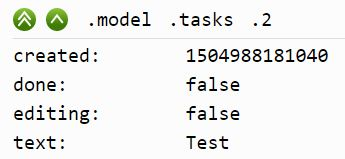

# User manual

This manual will describe the process of working with the devtool. If you wish
to know more about how the devtool works, look at the [Under the
hook](./under-the-hood.md) documentation.

## The devtool toolbar

You the devtool-enabled application is started, a toolbar is shown in the
lower-right corner of the tab. This toolbar will contain a duckweed leaf icon
which can be used to open and close the inspection panel.

## The inspection panel

The inspection panel contains controls for manipulating the application state,
and the details of the currently selected model state.

The top portion is called the 'scrubber' (the term comes from video editing
software), and is used to jump to different parts of the state. The lower
portion of the panel is called the diff panel and displays the model state at
the given scrubber position with some hints about the differences compared to
the previous state.

## The scrubber controls

The scrubber controls consist of the buttons and the scrubber bar.

The scrubber buttons are (from left to right):

- **Back:** Jump to previous state
- **Reset:** Clear all history except for the currently selected state
- **Next:** Jump to next state

**NOTE:** When you jump to a previous state, and then you interact with your
application, the history is rewritten. The state after the interaction is
recorded as the next step after the currently selected state, and the rest of
the state is removed. The history before the currently selected state (including
the currently selected state) will be retained.

The scrubber bar can be used to move from history state to history state in one
(relatively) smooth motion. This can be used to quickly search for a particular
state. To the right of the bar, you will see two numbers. The first number is
the current step in the history, and the second number is the total number of
steps (state changes).

## The diff panel

The diff panel is used to inspect the model state in more detail. The details of
the state are scoped. As you drill down into different properties of the model,
the displayed state details will be focused on the part of the model you drilled
down into.

The top of the diff panel contains the breadcrumbs bar. This bar says "Model" if
you are at the root of the model. As you drill down, you will see two buttons
and a list of keys. The first button (double-chevron) will take you back to the
root of the model, and the second button (single-chevron) will take you one
level up. The keys can be clicked and will take you to that particular portion
of the model state.

Below the breadcrumbs bar, you will see the model data. The data is shown as a
list of keys under the current key (or the root of the model) with the
associated values. The values are shown as is if they are not containers (arrays
and plain objects), and containers are shown as expand icons with a JSON
preview.

The expand icons look like these:

Clicking the expand icon will drill down into the object or the array and the
breadcrumb bar will update. Once you've drilled down, you can jump to different
parts of the history, and the diff panel scope will remain stable so you can
observe changes in that particular scope.

The display of the values may provide some cues as to what happend with them.

The values displayed in red signify values that have been removed:

The values displayed in green signify values that have been added (new key):

And the values displayed in violet are values that have been changed:

